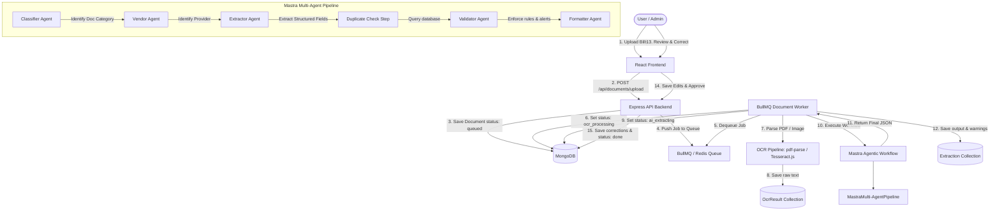

# Zero Carbon One - Agentic AI Utility Bill Extraction Platform

Zero Carbon One is a production-ready, full-stack application designed to automate the ingestion, OCR extraction, agentic AI classification, and validation of utility bills and industrial purchasing invoices. It empowers manufacturing companies to streamline carbon accounting, Scope 1 & Scope 2 emissions tracking, and audit reporting.

---

## 🏗️ Architecture Overview

The system processes uploaded bills through an asynchronous background pipeline managed by **BullMQ** and **Redis**. A multi-agent system powered by the **Mastra AI Framework** validates and structures the extracted data before submitting it to a human-in-the-loop review panel.



---

## ⚡ Setup & Launch Instructions

### Prerequisites
- **Docker** and **Docker Compose** installed on your system.
- **Node.js v20+** and **npm** (if running locally).
- **MongoDB** and **Redis** instances (if running locally).
- **OpenAI API Key** or **Anthropic API Key** (set in your `.env` file).

### Method A: Docker Compose Deployment (Recommended)
1. In the root directory, create a `.env` file or rely on shell environment variables. Specify your OpenAI / Anthropic keys:
   ```env
   OPENAI_API_KEY=your-openai-api-key
   ANTHROPIC_API_KEY=your-anthropic-api-key
   ```
2. Build and run the entire container stack using Docker Compose:
   ```bash
   docker-compose up --build
   ```
3. Open [http://localhost:3000](http://localhost:3000) in your web browser.

---

### Method B: Local Development Setup
If you want to run the backend and frontend services locally without Docker:

#### 1. Redis & MongoDB Setup
Ensure you have local instances of MongoDB (running on port `27017`) and Redis (running on port `6379`) active on your local machine.

#### 2. Backend Installation & Startup
1. Navigate to the `backend` folder:
   ```bash
   cd backend
   ```
2. Create a `.env` file containing local configurations (see `backend/.env.example` as a template):
   ```env
   PORT=5000
   NODE_ENV=development
   MONGO_URI=mongodb://127.0.0.1:27017/zerocarbon
   REDIS_HOST=127.0.0.1
   REDIS_PORT=6379
   JWT_SECRET=supersecretjwtkeyforzerocarbononeappdev
   JWT_REFRESH_SECRET=supersecretjwtrefreshkeyforzerocarbononeappdev
   OPENAI_API_KEY=your_openai_api_key_here
   ```
3. Install dependencies:
   ```bash
   npm install
   ```
4. Start the Express API server:
   ```bash
   npm run dev
   ```
5. In a separate terminal session, start the background worker:
   ```bash
   npm run worker
   ```

#### 3. Frontend Installation & Startup
1. Navigate to the `frontend` folder:
   ```bash
   cd frontend
   ```
2. Install dependencies:
   ```bash
   npm install
   ```
3. Start the Vite React app:
   ```bash
   npm run dev
   ```
4. Open [http://localhost:3000](http://localhost:3000) in your web browser.

---

## 🤖 AI Components & Extraction Approach

### 1. Hybrid OCR Pipeline
- **Direct PDF Text Parsing**: The system first attempts to extract the embedded text direct from PDFs using `pdf-parse`. If the text contains valid characters greater than our minimum character threshold (`100` characters), it bypasses image OCR.
- **Tesseract.js Image OCR Fallback**: If direct extraction fails (or returns a low character count, suggesting a scanned document), the system routes the file path to Tesseract OCR to process it page-by-page.

### 2. Mastra Agentic AI Workflow
The backend defines a 6-step Mastra workflow orchestration using the following specialized LLM agents:
1. **Classifier Agent**: Categorizes the document type into one of our sustainability schemas (e.g. `electricity_bill`, `diesel_invoice`, `coal_invoice`, `water_bill`, `gas_bill`, etc.).
2. **Vendor Agent**: Extracts and standardizes the utility provider or vendor name (matching against lists of known vendors like Tata Power, Adani Electricity, BSES, BPCL, Coal India, etc.).
3. **Extractor Agent**: Extracts specific attributes based on the classified document type.
4. **Duplicate Check Step**: Integrates with MongoDB to query past extractions and check for duplicates (matching `invoice_number` + `vendor` or `consumer_number` + `billing_period`).
5. **Validator Agent**: Evaluates the extraction fields for compliance warnings: checks for missing mandatory fields, negative consumption parameters, or due dates that precede invoice dates.
6. **Formatter Agent**: Restructures the aggregated metadata outputs into our final schema payload, computes overall confidence scores, and sanitizes dates into `YYYY-MM-DD`.

---

## 🏛️ MongoDB Database Design

The database initialization schema is managed in `backend/src/config/dbInit.js` and creates the following structure:
- **`users`**: Manages credentials, password hashes (hashed with bcrypt), refresh tokens, and RBAC roles (`admin`, `user`).
- **`documents`**: Tracks original file metadata, upload history, and pipeline processing status (`queued`, `ocr_processing`, `ai_extracting`, `done`, `failed`).
- **`ocr_results`**: Stores the raw text output, page count, and quality score returned by the OCR pipeline.
- **`extractions`**: Holds the structured parameters extracted by the Mastra workflow (e.g., `units_kwh`, `quantity_litres`, `total_amount`), along with confidence scores, validation warnings, and agent traces.
- **`approvals`**: Audits human-in-the-loop updates, saving the reviewer's ID, field-level corrections logs, final approved JSON output, and comments.

---

## 🛡️ Role-Based Access Control (RBAC)
- **Automatic First Admin Creation**: When the system runs on an empty database, the very first user who registers is automatically assigned the `admin` role.
- **User Permission Boundary**:
  - Regular **Users** can only view and upload their own documents.
  - **Admins** have full access to view, edit, approve, and delete documents across all users, as well as accessing the Admin Audit log screen.

---

## 🎨 Design Decisions & Premium Aesthetics
- **Carbon Emerald Aesthetic**: The frontend is styled using custom HSL/RGB colors following an obsidian dark theme (#0b0f19) paired with neon emerald green accents (#10b981) to represent sustainability.
- **Glassmorphic Panels**: The layout utilizes cards with subtle drop shadows, transparent navy overlays (`rgba(21, 28, 44, 0.65)`), and background radial gradients to evoke state-of-the-art designs.
- **Micro-Animations**: Features pulsing status logs, loader spin animations, responsive hover transformations, and detailed carbon charts utilizing Chart.js.
# Zero-carbon

