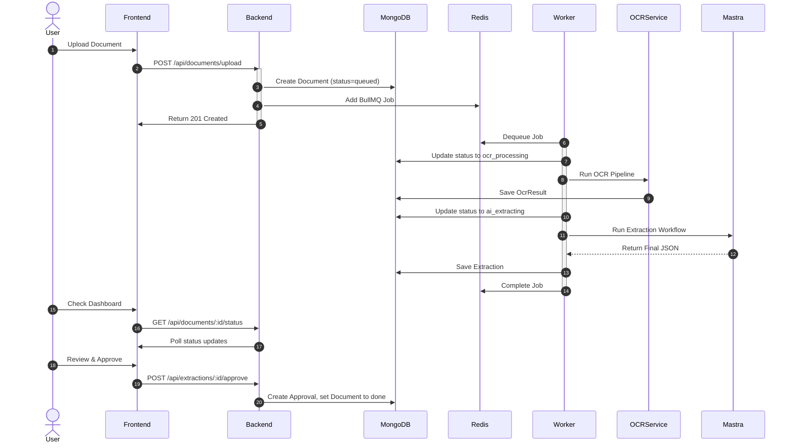

# Architecture

## System Architecture Overview

Zero Carbon One uses a modular, microservices-inspired architecture with Docker Compose orchestration.

```mermaid
flowchart LR
    subgraph "Client Layer"
        Browser[Web Browser]
    end

    subgraph "Presentation Layer"
        Frontend[React Frontend (Nginx)]
    end

    subgraph "API Layer"
        Backend[Express API Server]
    end

    subgraph "Queue & Worker Layer"
        Redis[(Redis)]
        Worker[BullMQ Document Worker]
    end

    subgraph "AI & OCR Layer"
        Mastra[Mastra AI Orchestrator]
        Agents[Multi-Agent System]
        OCRService[OCR Pipeline (pdf-parse + Tesseract)]
        LLMs[LLMs (OpenAI / Anthropic / Google)]
    end

    subgraph "Data Layer"
        MongoDB[(MongoDB Database)]
    end

    Browser --> Frontend
    Frontend --> Backend
    Backend --> Redis
    Backend --> MongoDB
    Redis --> Worker
    Worker --> OCRService
    Worker --> Mastra
    Mastra --> Agents
    Agents --> LLMs
    Worker --> MongoDB
```

---

## Document Processing Pipeline

This is the core flow of a document from upload to approval:



---

## Backend Component Architecture
